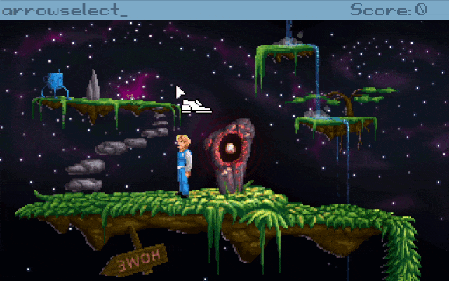

# ArrowSelect
Select things using arrows, module for in point and click games made with
Adventure Game Studio

[Get Latest Release under **Assets**](https://github.com/ericoporto/arrowselect/releases/latest) | [AGS Forum Topic](https://www.adventuregamestudio.co.uk/forums/index.php?topic=57379.0)



_Note:_ This module doesn't deal with printing things on screen, but if you want to do
this, you may find it provides some helpful functions with the Interactives
abstraction.

## Basic usage

For basic usage with Keyboard, in your global script, add:

```AGS Script
ArrowSelect.enableKeyboardArrows();
```

## Usage with joystick

If you are using a joystick or gamepad plugin, you will need to implement your
own function to deal with. An example for hat is below.

```AGS Script
    //pressed a hat
    void pressedPov(int pov){
      if(pov == ePOVCenter){
      } else if(pov == ePOVDown){
        ArrowSelect.moveCursorDirection(eDirectionDown);
      } else if(pov == ePOVLeft){
        ArrowSelect.moveCursorDirection(eDirectionLeft);
      } else if(pov == ePOVRight){
        ArrowSelect.moveCursorDirection(eDirectionRight);
      } else if(pov == ePOVUp){
        ArrowSelect.moveCursorDirection(eDirectionUp);
      } else if(pov == ePOVDownLeft){
        ArrowSelect.moveCursorDirection(eDirectionDownLeft);
      } else if(pov == ePOVDownRight){
        ArrowSelect.moveCursorDirection(eDirectionDownRight);
      } else if(pov == ePOVUpLeft){
        ArrowSelect.moveCursorDirection(eDirectionUpLeft);
      } else if(pov == ePOVUpRight){
        ArrowSelect.moveCursorDirection(eDirectionUpRight);
      }
      return;
    }
```

## What are Interactives ?

Interactives are things on screen that the player can interact with.
These are Objects, Characters, Hotspots, and GUI Controls like buttons and others.
This module only cares for their type, and a position that is similar to the
thing center that mouse can click.

Note that some gotchas apply, for example, if you have three different Hotspots
areas that map to the same Hotspot, instead of finding out they are different,
it will erroneously find a point in the center of them. So if you have, for
example, two TVs in your background, that have the same interaction, create
two different hostpots for them and just map the same interaction function to
both, otherwise this module will fail.

```AGS Script
enum InteractiveType{
  eInteractiveTypeNothing = eLocationNothing,
  eInteractiveTypeObject = eLocationObject,
  eInteractiveTypeCharacter = eLocationCharacter,
  eInteractiveTypeHotspot = eLocationHotspot,
  eInteractiveTypeGUIControl,
  eInteractiveTypeGUI,
};

managed struct Interactive{
  int x;
  int y;
  int ID;
  InteractiveType type;
};
```

## ArrowSelect API

### `bool ArrowSelect.moveCursorDirection(CharacterDirection dir)`

Moves cursor to the nearest interactive available at a direction. Returns true if the
cursor is successfully moved.


### `Point* ArrowSelect.getNearestInteractivePointAtDirection(CharacterDirection dir)`

Get point of the nearest interactive available at a direction. Returns true if the
cursor is successfully moved.


### `void filterInteractiveType(InteractiveType interactiveType, InteractiveFilter filter=0)`

Filters or not a interactive type for cursor moveCursorDirection and getNearestInteractivePointAtDirection.


### `bool ArrowSelect.areKeyboardArrowsEnable()`

Returns true if regular keyboard arrows are enabled for cursor movements.


### `bool ArrowSelect.enableKeyboardArrows(bool isKeyboardArrowsEnabled = 1)`

Enables or disables (by passing `false`) regular keyboard arrows handled by this
module.


### `Triangle* ArrowSelect.triangleFromOriginAngleAndDirection(Point* origin, int direction, int spreadAngle=90)`

Returns a Triangle instance with one point at the origin points and the two
other points separated by spreadAngle, and at the direction angle


### `int ArrowSelect.distanceInteractivePoint(Interactive* s, Point* a)`

Retuns the distance between an interactive and a point.


### `Interactive* ArrowSelect.closestValidInteractivePoint(Interactive* Interactives[], Point* a)`

Returns the closest interactive to a point.


### `Interactive*[] ArrowSelect.getInteractives()`

Get a list of all interactives on screen.


### `bool ArrowSelect.isInteractiveInsideTriangle(Interactive* p, Point* a, Point* b, Point* c)`

Returns true if an interactive is inside a triangle defined by three points.


### `Interactive*[] ArrowSelect.whichInteractivesInTriangle(Interactive* Interactives[], Point* a, Point* b, Point* c)`

Returns a list of which triangles are inside a triangle defined by three points.


## Implementation details

This is just the detail on how things works on this module


### Problem

By using keyboard arrow keys or joystick directional hat, select between
clickable things on screen.


### Solution

When the player press an arrow button do as follow:

1 .get the x,y position of each thing on screen,

2 .select only things on arrow button direction (example:at right of current
  cursor position, when player press right arrow button),

3 .calculate distance from cursor to things there, and get what has the smaller
  distance


### Solution details

For 2, the key is figuring out the right angle and then create a triangle that
extends to screen border, the things inside the triangle can be figured with the
function below

https://stackoverflow.com/a/9755252/965638
```
public static bool PointInTriangle(Point p, Point p0, Point p1, Point p2)
{
    var s = p0.Y * p2.X - p0.X * p2.Y + (p2.Y - p0.Y) * p.X + (p0.X - p2.X) * p.Y;
    var t = p0.X * p1.Y - p0.Y * p1.X + (p0.Y - p1.Y) * p.X + (p1.X - p0.X) * p.Y;

    if ((s < 0) != (t < 0))
        return false;

    var A = -p1.Y * p2.X + p0.Y * (p2.X - p1.X) + p0.X * (p1.Y - p2.Y) + p1.X * p2.Y;

    return A < 0 ?
            (s <= 0 && s + t >= A) :
            (s >= 0 && s + t <= A);
}
```


## Author

Made by Érico Vieira Porto


## License

Distributed under MIT license. See [LICENSE](https://github.com/ericoporto/arrowselect/blob/master/LICENSE) for more information.
